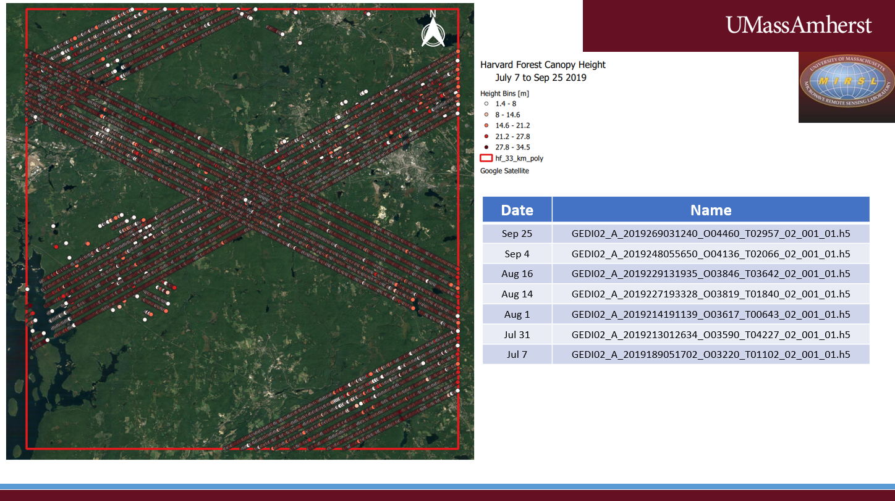
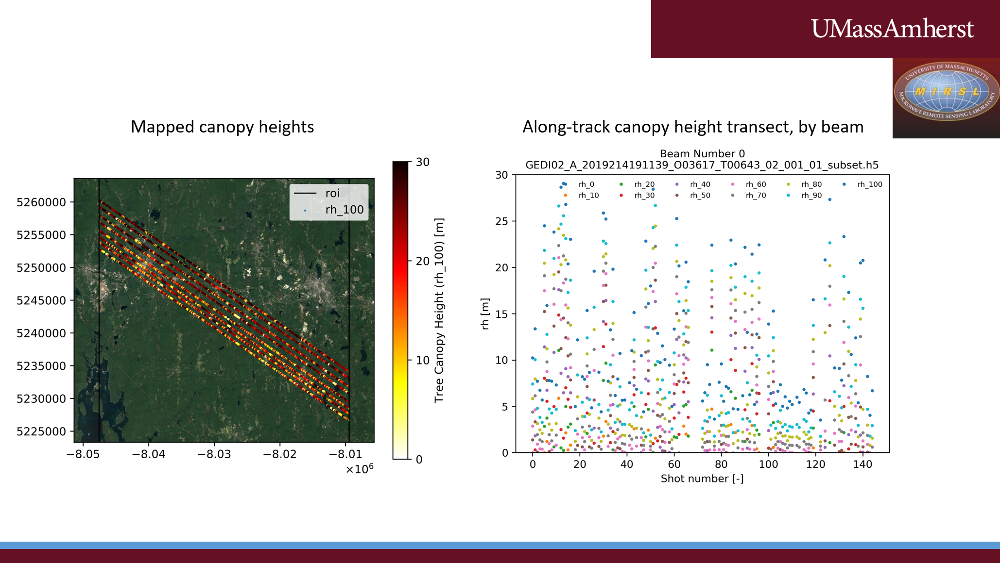

# GEDI_tools

The easiest way to use the tool is to copy the folders into the same base directory. Then sequentially run the code, starting with the folders having the lowest prefix (i.e. '0_'). If there are python scripts in the folders, they are also labelled in the sequence in which they are to be run. 

## GEDI_tools consist of:

1. 'get_shapefile_ALSO': A Jupyter Notebook containing instructions and code for obtaining ALOS PALSAR 1 data. Because we're interested in time series analysis, to obtain the largest time series we focus on the intersection area of all the ALOS PALSAR 1 imagery of a given path/row. The result is a polygon shapefile (the 'ROI') consisting of the intersection of all of the path/row imagery. The ROI can then be used to subset the GEDI data.
2. 'find_GEDI_data': A Jupyter Notebook that helps put together the search string URL as input to the GEDIFinder tool. We also provide the GEDIFinder tool documentation as reference, which explains the available parameters and formatting of the URL query. This Jupyter Notebook uses the ROI from Step 1. The result is a URL that can be copied and pasted to a browser. The URL will have the download links to all the GEDI data ('h5 files') that fell inside the ROI.
    - Caveat: It is possible that few of the h5 files don't actually have any data falling into the polygon resulting from Step 1. The reason is that the GEDI search URL only uses the upper left and lower right coordinates of the ROI to create a search box - hence the ROI given to the GEDIFinder tool can be relatively larger than that created in Step 1.
3. 'read_gedi_output_roipts_as_h5_subset' containing two Python Scripts:
    1. read_gedi_get_indices_for_subset.py. This script goes through every data point in the h5 files. Because each point is checked whether it falls into the ROI, the code can be a little slow, maybe around 1 minute per h5 file. For this step, the center coordinates of the single gaussian fit to the waveform are used, and one may alter the code to use the coordinates of the lowest mode or highest return instead. This script produces two outputs: 
        1. A shapefile showing all the points falling into the ROI. This can be useful for visualizing potential data availability. 'Potential', because data had not yet been screened according to quality flags.
        2. A CSV file denoting the indices of each point that fell into the ROI. This is done to greatly speed up a more thorough data extraction in the next step.
    2. use_indices_to_subset_h5.py. This script goes through each h5 file, but only at the indices identified in the prior script. We extract many of the relevant GEDI fields that we would use for our work, but there exist more and they can be added as needed. This script has one output:
        1. A h5 file only containing the data of the subset. This is a much smaller file than the original, on the order of a few MB for a single ROI corresponding to one ALOS PALSAR 1 path/row combination. It is the same name as the original file, but with '_subset' appended.
4.  'plot_h5_subset', containing two Python Scripts:
    1. plot_h5_subset. This script screens data for quality. The user provides valueses of quality flag (default: 1), sensitivity (0.9) and degrade (0.0). Because there are 101 rh percentile values, the user can also specify whether to only show every Xth value (default: 10). We also create one more flag, comparing the value of 'dem' to lowest mode. If they differ by more than XX meters (default: 30) we assume the data is bad, i.e. fog or a cloud. This time we use the lowest mode latitude and longitude rather than the center of the waveform. There was no particular reason for this change, other than trying to be consistent with the GEDI tutorial provided at https://lpdaac.usgs.gov/resources/e-learning/getting-started-gedi-l2a-data-python/. There are two outputs:
        1. A shapefile of points meeting the quality criteria, one for each beam.
        2. A plot of the along-track canopy height of all the rh_values used (default 10)
    2.  aggregate_shp_plot_spatial.py. This script generates a spatial plot, according to color scheme (default: hot_r), scaling (default: min 0 m, max 30 m) and rh_parameter (default: rh_90). There are two outputs:
        1. A shapefile of all the beams combined, one shapefile per h5 file. These shapefiles contain all the data fields we originally extracted. This facilitates analysis and visualization using software such as QGIS or ArcGIS.
        2. A pdf file showing the GEDI shot locations, colored according to the user specified rh value. There is one pdf for each h5 file.
